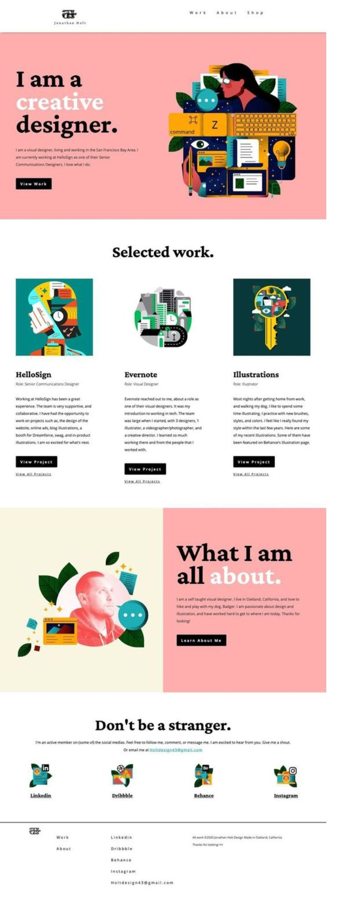
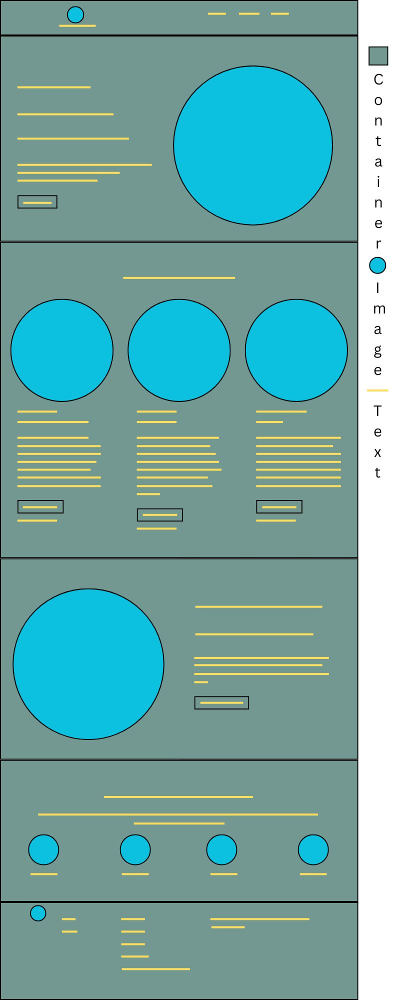

<a name="readme-top"/>

<br/>

<br />
<div align="center">
  <a href="https://github.com/zyx-0314/">
  <!-- TODO: If you want to add logo or banner you can add it here -->
    
  </a>
<!-- TODO: Change Title to the name of the title of your Project -->
  <h3 align="center">Title</h3>
</div>
<!-- TODO: Make a short description -->
<div align="center">
  Short Description. (Optional)
</div>

<br />

<!-- TODO: Change the zyx-0314 into your github username  -->
<!-- TODO: Change the WD-Template-Project into the same name of your folder -->


---

<br />
<br />

<!-- TODO: If you want to add more layers for your readme -->
<details>
  <summary>Table of Contents</summary>
  <ol>
    <li>
      <a href="#overview">Overview</a>
      <ol>
        <li>
          <a href="#key-components">Key Components</a>
        </li>
        <li>
          <a href="#technology">Technology</a>
        </li>
      </ol>
    </li>
    <li>
      <a href="#rules-and-principles">Rules and Principles</a>
    </li>
    <li>
      <a href="#resources">Resources</a>
    </li>
  
   </li>
    <li>
      <a href="#documentation">Documentation</a>
    </li>
  </ol> 
<li>
This is my Inspiration for this Activity it is a Portfolio type website wherein it showcases the designs the creator made. 


 This is the Wireframe of the website I've chosen wherein I dentified which is a container, image, and text. 


 </li> 
   
      
</details>

---

## Overview

<!-- TODO: To be changed -->
<!-- The following are just sample -->
The project is about the task we were given which was to create a resume website using the tips, and techniques taught to us by our Instructor with additional add ons from what I've personally learned and found. You'll find in my website are informations about me, along with some background information, educational attainments, and some of the works I've done. 

### Key Components
<!-- TODO: List of Key Components -->
<!-- The following are just sample -->
- Single Page Website
- Parallax transition
    Ex. Parallax Scrolling, etc.


### Technology
<!-- TODO: List of Technology Used -->


## Rules and Principles
1. Always use ***WD-*** in the Title of the Project for the Subject
2. Do not rename any .html files; always use 'index.html' as the filename.
3. File Structure to follow

```
WD-ProjectName
└─ assets
|   └─ css
|   |   └─ style.css
|   └─ js
|   |   └─ script.js
|   └─ img
|       └─ fileWith.jpeg/.jpg/.webp/.png
└─ pages
|  └─ pageName
|     └─ index.html
|     └─ assets
|        └─ css
|        |  └─ style.css
|        └─ js
|        |  └─ script.js
|        └─ img
|           └─ fileWith.jpeg/.jpg/.webp/.png
└─ index.html
└─ readme.md
```

## Resources

<!-- TODO: Add References -->
| Title | Purpose | Link |
|-|-|-|
| Parallax Scrolling | I've integrated a parallax scrolling for the style of the web | [https://www.w3schools.com/howto/howto_css_parallax.asp] |
| Sample Title | Sample purpose would be here like this and this is the example of what it is. | trykolang.com |
